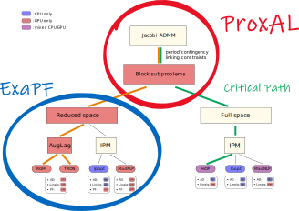

# DOPT.jl
Integration package for ECP

*	For the critical path of the project each period or subproblem ACOPF is solved in the full space using HiOP (green path).
*	Alternatively, the subproblems are solved using a reduced space method that is designed to run entirely on the GPU on Summit at OLCF (orange path).
